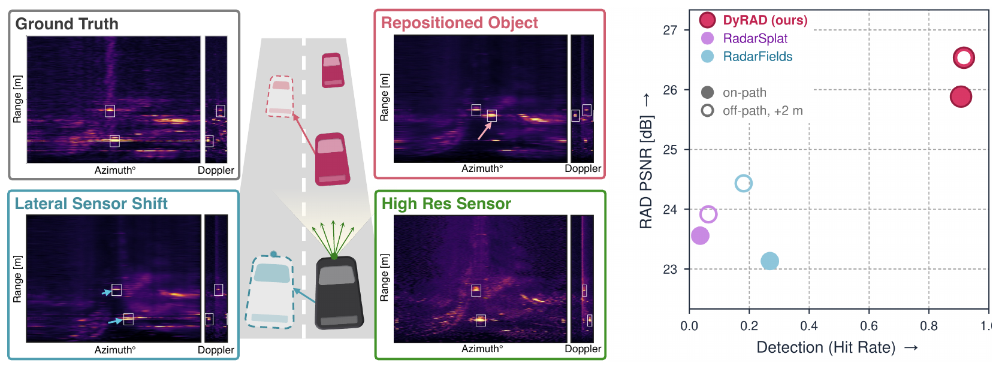

# DyRAD: Radar Novel View Synthesis for Dynamic Driving Scenes

<p align="center"></p>

<p align="center"><a href="https://arxiv.org/abs/2609.39841">Paper (arXiv)</a> · <a href="https://dyrad-nvs.github.io">Project page</a> · <a href="https://huggingface.co/datasets/DyRAD/dyrad-synthetic">Synthetic benchmark (Hugging Face)</a></p>

Code and configurations for the paper *DyRAD: Radar Novel View Synthesis for Dynamic Driving
Scenes*. DyRAD reconstructs a dynamic driving scene from recorded range–azimuth–Doppler (RAD)
radar tensors, sensor poses and object boxes, and renders RAD tensors at new sensor poses:

- **Point reflectors**: static background reflectors plus dynamic reflectors that follow learned
  rigid object tracks initialized from the annotations (paper Sec. 3.1).
- **Doppler**: every reflector's radial velocity (ego motion and object motion) places it on the
  Doppler axis, so Doppler is both rendered and used to supervise the tracks.
- **Fixed sensor PSF**: reflectors are rendered through the sensor's point-spread function derived
  from its signal-processing chain (Hamming-FFT range and Doppler responses and the measured
  beamformer response on RADIal), which keeps sensor-induced spread out of the scene and enables
  sensor-configuration transfer (paper Sec. 3.2, 4.3).
- **Off-path evaluation**: displaced ground-truth views on a synthetic benchmark and a
  render-and-refit protocol on real recordings (paper Sec. 4.2).

Supported data: **RADIal** (77 GHz MIMO radar, 16-bin Doppler axis), **Boreas** (Navtech spinning
radar, range–azimuth only) and the **synthetic benchmark** with ground-truth off-path views.

## Repository layout

```
dyrad/                       the package
  train.py                   training entry point (python -m dyrad.train --config ...)
  trainer/                   the model and training loop: runner.py (setup, loop, loss),
                             initialization.py (reflectors and tracks from the init cloud and
                             the object boxes), rendering.py (the RAD renderer), measurement.py
                             (the measurement domain the loss and metrics use), densification.py,
                             evaluate.py (held-out metrics), visualize.py, checkpoint.py
                             (checkpoints, provenance)
  psf.py  tracks.py  loss.py the fixed sensor PSF, the rigid object tracks, L_rec
  config.py                  the run config and the yaml loader (`base:` inheritance)
  constants.py  paths.py     shared sensor constants; the repository root
  data.py  poses.py  axes.py  labels.py  norm.py  domains.py  radial_calib.py  ra_partition.py
                             sequence loading, poses, bin axes, label indexing, normalization,
                             tensor domains, the RADIal CalibrationTable (azimuth beamformer),
                             free-space partition
  evaluation/                metric library (radar_metrics.py; pointcloud_metrics.py for the
                             detection metrics; region_masks.py for the object region), the scorer (score_renders.py), novel-view rendering of a
                             trained model (novel_view.py) and the evaluation entry points below
  offpath_real/              real-data off-path protocol (python -m dyrad.offpath_real ...)
  synthetic/                 synthetic benchmark: scene specs (scenes/), generator, off-path views
  preprocessing/             RADIal and Boreas preprocessing, init-cloud builder, normalization
  generate_configs.py        writes every per-run config from the stubs, recipes and variants
configs/
  recipes/                   sensor + training recipes: radial.yaml, boreas.yaml, synthetic.yaml
  sequences/                 one stub per sequence: data paths, frame window, sensor overrides
  variants/                  one file per method variant (see table below)
  radial/ boreas/ synthetic/ GENERATED per-run configs  <seq>_<variant>.yaml
  offpath_real/              GENERATED off-path configs  <dataset>_<seq>_<variant>_{M0,M1}.yaml,
                             and the T0 scoring config  <dataset>_<seq>_score_T0.yaml
  benchmarks/                off-path benchmark definitions, synthetic normalization ranges
third_party/gsplat/          trimmed gsplat fork holding the radar CUDA kernels (Apache-2.0)
tests/                       pytest tests (CPU, plus one GPU test of the CUDA PSF kernel)
assets/                      the README teaser figure (paper Fig. 1)
```

Method variants (`configs/variants/`), named as in the paper:

| variant | paper name |
|---|---|
| `dyrad` | DyRAD, the full method |
| `dyrad_static` | DyRAD-static: all reflectors static, no box separation at initialization |
| `abl_no_doppler` | w/o Doppler: loss on the Doppler-averaged RA map only (Sec. 4.4) |
| `abl_no_interp` | w/o L_int: no interpolation-consistency term (Sec. 4.4) |
| `abl_learned_extent` | Gaussian primitives with learned extent instead of the fixed PSF (Sec. 4.4) |
| `abl_learned_psf` | point reflectors with learned PSF bandwidths (Sec. 4.4) |

The paper's Table 3 hyperparameters keep their config names: `interp_consist_weight`, `means_lr`,
`opacities_lr`, `sh_coeffs_lr`, `deform_lr`.

## Installation

Tested with Python 3.10, PyTorch 2.4.0 and torchvision 0.19.0 (CUDA 11.8 builds) on Linux with
an RTX 4090.

```bash
conda env create -f environment.yml
conda activate dyrad
pip install -e .

# Radar CUDA kernels. nvcc 11.8 needs gcc <= 11; environment.yml installs gcc 11, and CC/CXX
# must point at it because PyTorch passes $CC to nvcc as -ccbin.
CC=$CONDA_PREFIX/bin/x86_64-conda-linux-gnu-gcc CXX=$CONDA_PREFIX/bin/x86_64-conda-linux-gnu-g++ \
  pip install -e ./third_party/gsplat --no-build-isolation
python -c "from gsplat.cuda._backend import _C; assert _C is not None; print('OK')"
```

Install editable from a source checkout: `configs/`, `data/` and `results/` are resolved relative
to the repository root, and all commands below run from it. The fixed-PSF renderer needs the CUDA
extension and refuses to run without it.

**Quick start.** The synthetic benchmark needs no download and no RADIal repository, only the
CUDA build:

```bash
python -m dyrad.synthetic.prepare --scenes intersection
python -m dyrad.train --config configs/synthetic/intersection_dyrad.yaml
python -m dyrad.evaluation.evaluate_offpath_synthetic --config configs/synthetic/intersection_dyrad.yaml \
    --views data/synthetic/intersection
```

## Data

### RADIal

1. Download the RADIal raw recordings and the official labels (`labels_CVPR.csv`) from the
   [RADIal repository](https://github.com/valeoai/RADIal), clone that repository to
   `data/radial_processed/RADIal_repo` (its `DBReader/` and
   `SignalProcessing/CalibrationTable.npy` are used by preprocessing and by the azimuth PSF),
   unpack each `RECORD@...` recording into `data/radial_raw/`, and place the labels at
   `data/radial_raw/ready_to_use/labels_CVPR.csv`. The RADIal `DBReader` imports OpenCV
   (`opencv-python-headless` in `requirements.txt`).
2. Process a recording (RAD tensors, GPS track, CAN ego velocity, poses_can):
   ```bash
   python -m dyrad.preprocessing.radial pipeline \
       --recording data/radial_raw/RECORD@2020-11-22_12.31.22 --out-dir data/radial_processed/seq_31_22
   ```
   The coarse sensor configuration of the transfer experiment is the same recording processed
   with `--sensor coarse --out-dir data/radial_processed/seq_31_22_coarse`.
3. Prepare a 60-frame training window. This writes the sequence stub and its run configs, the
   normalization sidecar `norm.json`, and the two init clouds (RA-partitioned for `dyrad` and the
   ablations, unpartitioned for `dyrad_static`), both built from the training frames only:
   ```bash
   python -m dyrad.preprocessing.radial prepare --seq seq_31_22 --frame-start 119
   python -m dyrad.preprocessing.radial prepare --seq seq_31_22_coarse --frame-start 119   # transfer experiment
   ```
   The paper's ten sequences and windows are the stubs `configs/sequences/radial_*.yaml`; each
   holds its recording (`seq_name`) and `frame_start`, so steps 2 and 3 for all ten are:
   ```bash
   for stub in configs/sequences/radial_*[0-9].yaml; do
     id=$(basename "$stub" .yaml); id=${id#radial_}
     rec=$(awk '/^seq_name:/ {print $2}' "$stub"); fs=$(awk '/^frame_start:/ {print $2}' "$stub")
     python -m dyrad.preprocessing.radial pipeline --recording "data/radial_raw/$rec" \
         --out-dir "data/radial_processed/seq_$id"
     python -m dyrad.preprocessing.radial prepare --seq "seq_$id" --frame-start "$fs"
   done
   ```
   `prepare` keeps an existing stub and refuses a `--frame-start` that does not match its
   window (`--force` overwrites the stub).

The RADIal poses dead-reckon the CAN wheel speed at the 0.2 s radar frame period, and the trainer
places the object tracks on the same frame clock (`poses_can/frame_slots.npy`: one period per
frame, two across the one dropped frame in the paper windows): the recorded frame stamps stall
and then compress, so they are not used as a clock (see `dyrad/preprocessing/radial/poses.py`).
Boreas uses its recorded scan stamps.

### Boreas

The annotated recording `boreas-objects-v1` is used. One command runs the whole chain for a
paper window: download, staging, RAD tensors and poses, moving-object labels, float32-safe
recentred poses, the normalization sidecar `norm.json` and the init clouds:

```bash
python -m dyrad.preprocessing.boreas prepare-window --window win55_104     # or sparse2, sparse4
```

The steps are the subcommands of `python -m dyrad.preprocessing.boreas` (`fetch`, `prepare`,
`convert`, `labels`, `recentre`), each documented by its `--help`. The three windows used in the paper are the stubs
`configs/sequences/boreas_*.yaml`.

### Synthetic benchmark

```bash
python -m dyrad.synthetic.prepare    # 5 scenes x (base + 5 off-path views), norm.json, init clouds
```

Scene specifications are in `dyrad/synthetic/scenes/`; generation is deterministic (seed 42, 40
frames). Every scene is rendered at the base trajectory and at lateral offsets of −1.75, +1.75 and
+3.5 m and yaw offsets of +5° and +10°. `prepare` also measures each scene's RA / RD / AD
normalization ranges for the scorer and writes them into the tracked file
`configs/benchmarks/synthetic_norm_ranges.json`. It reuses a scene's existing views and its
`norm.json` (and says so); delete `data/synthetic/<scene>/` to regenerate after changing a scene
or the generator.

The generated benchmark is also on the Hugging Face Hub
([DyRAD/dyrad-synthetic](https://huggingface.co/datasets/DyRAD/dyrad-synthetic)), byte-identical to
the output of `prepare`. To download it instead of generating it (`prepare` then reuses the views):

```bash
hf download DyRAD/dyrad-synthetic --repo-type dataset --exclude "frames/*" "rad/*" \
    --local-dir data/synthetic
```

## Training

```bash
python -m dyrad.train --config configs/radial/31_22_dyrad.yaml
python -m dyrad.train --config configs/boreas/win55_104_dyrad.yaml
python -m dyrad.train --config configs/synthetic/intersection_dyrad.yaml
```

Outputs go to the config's `result_dir` (`results/<dataset>/<seq>/<variant>/`): the final
checkpoint `ckpt_final.pt`, `provenance.json` (commit, command line and the resolved config),
`train_log.csv` and its plot, `train_meta.json` (wall time and peak GPU memory) and the rendered
frames at `render_save_steps`. On RADIal and Boreas every 5th recording frame (global index) is
held out; the synthetic benchmark and the off-path fits hold out nothing (`test_every: 0`). The
initialization (reflectors, object tracks) uses the training frames' measurements and boxes only.
Initialization is deterministic at a fixed seed; during training, CUDA float atomics make
identical runs diverge slightly.

Run configs are generated: edit a stub, recipe or variant and run
`python -m dyrad.generate_configs` (`--check` verifies the committed files).

## Evaluation

```bash
# On-path (held-out frames): full metric panel -> <result_dir>/metrics_extended_val.json
python -m dyrad.evaluation.score_checkpoint --config configs/radial/31_22_dyrad.yaml

# Visualize a checkpoint: measurement / render panels of its frames, optionally as a video
python -m dyrad.evaluation.render_checkpoint --config configs/radial/31_22_dyrad.yaml --video

# Boreas: keep the renders, then score in the sensor's log-count domain: full frame, and the
# labelled moving-vehicle windows (--dynamic). --radarsplat / --radarfields add the baseline rows
# from renders produced with the baselines' own code (not part of this release).
python -m dyrad.evaluation.score_checkpoint --config configs/boreas/win55_104_dyrad.yaml --keep
python -m dyrad.evaluation.score_boreas --seq win55_104 --variant dyrad [--radarsplat DIR] [--radarfields DIR]
python -m dyrad.evaluation.score_boreas --seq win55_104 --variant dyrad --dynamic [--radarsplat DIR] [--radarfields DIR]

# Synthetic off-path views (ground truth rendered from never-driven trajectories): renders and
# scores every view -> <result_dir>/offpath_eval/<view>/metrics_extended.json (--keep-renders
# keeps each view's renders_npy/)
python -m dyrad.evaluation.evaluate_offpath_synthetic --config configs/synthetic/intersection_dyrad.yaml \
    --views data/synthetic/intersection

# Sensor-configuration transfer: a model fitted to the coarse configuration rendered with the
# native PSF and sampling grid (direct rendering), or its coarse render linearly upsampled
python -m dyrad.evaluation.sensor_transfer --config configs/radial/31_22_coarse_dyrad.yaml \
    --target-config configs/radial/31_22_dyrad.yaml                       # direct rendering
python -m dyrad.evaluation.score_checkpoint --config configs/radial/31_22_coarse_dyrad.yaml --keep
python -m dyrad.evaluation.sensor_transfer --route upsample --config configs/radial/31_22_coarse_dyrad.yaml \
    --target-config configs/radial/31_22_dyrad.yaml                       # linear upsampling of the coarse render
```

Both routes score the native held-out frames and write to
`results/sensor_transfer/<seq>/coarse_to_native[_upsample]/`. Direct rendering scales the
coarse-trained reflector amplitudes by the analytic FFT processing gain (512/128)·(256/128) = 8 and
adds the native sequence's noise pedestal: each reflector is a point target rendered through the
native PSF, and a point target's amplitude grows with the number of samples and chirps of the
unnormalized FFTs. Linear upsampling scales the coarse render by √8 and swaps the coarse pedestal
for the native one: the interpolation weights sum to one, so each coarse bin keeps its level
instead of being re-formed from point targets, and √8 is the level by which the measured native
and coarse cubes of a recording differ (×8 would over-scale the interpolated render).

**Real-data off-path evaluation** (paper Table 2): fit M0 on the recorded window, render it along
the trajectory shifted laterally by 2 m, fit M1 on those renders, render M1 back at the original
poses and score it against the real measurements. For one sequence and variant:

```bash
python -m dyrad.offpath_real build-view --seq 31_22 --view T0          # real measurements, re-indexed
python -m dyrad.offpath_real build-view --seq 31_22 --view T1          # shifted poses, labels, axes
python -m dyrad.offpath_real init-cloud --seq 31_22 --variant dyrad --stage M0   # M0 init cloud
python -m dyrad.train --config configs/offpath_real/radial_31_22_dyrad_M0.yaml
python -m dyrad.offpath_real render   --seq 31_22 --variant dyrad     # M0 along the shifted path
python -m dyrad.offpath_real init-cloud --seq 31_22 --variant dyrad --stage M1   # M1 init cloud, from the renders
python -m dyrad.train --config configs/offpath_real/radial_31_22_dyrad_M1.yaml
python -m dyrad.offpath_real evaluate --seq 31_22 --variant dyrad     # M1 back at the original poses
python -m dyrad.offpath_real score    --seq 31_22 --variant dyrad     # against the real measurements
```

For the Boreas windows, put `--benchmark boreas` before the subcommand, e.g.
`python -m dyrad.offpath_real --benchmark boreas build-view --seq win55_104 --view T0`.
`init-cloud` takes the noise factor and voxel from the benchmark's `init_cloud` block
(`configs/benchmarks/offpath_real_<dataset>.json`) and builds the unpartitioned cloud for
`dyrad_static`. The M1 config's training data are the view written by `render`, so run `render`
before the M1 `init-cloud` and training.

Metrics are defined in `dyrad/evaluation/radar_metrics.py` and, for detection,
`dyrad/evaluation/pointcloud_metrics.py`. RA and RD maps are the mean of the
cube over the collapsed axis; each view is clipped and normalized on a fixed linear range before
PSNR, SSIM, LPIPS and Pearson correlation. Detection metrics apply RADIal's RD-CFAR detector (its window
and 2 dB threshold, applied to the azimuth-summed amplitude) to the
reference and synthesized tensors and compare the point clouds with the RadarGen protocol.

**Scoring another method's renders.** `score_renders` scores any directory of renders with the
same scorer, so another method is compared on the paper's metrics. Write the frames to
`<dir>/renders_npy/`:

```
renders_npy/pred_<f>.npy       predicted RA map [R, A] (range-cropped as the config, mean over Doppler)
renders_npy/gt_<f>.npy         measured RA map, same shape
renders_npy/pred_rad_<f>.npy   optional: full [D, R, A] cubes; needed for the RD / RAD
renders_npy/gt_rad_<f>.npy       and Doppler metrics and the point-cloud detection family
renders_npy/_domain.json       {"domain": "raw_power"} (or another dyrad.domains.Domain)
```

`<f>` is the frame index of the config's sequence (a view's own index for off-path views). Then:

```bash
python -m dyrad.evaluation.score_renders <dir> --config configs/radial/31_22_dyrad.yaml --split val
python -m dyrad.evaluation.score_renders <dir> --config configs/offpath_real/radial_31_22_score_T0.yaml \
    --labels data/radial_processed/offpath_real/seq_31_22/T0/labels_CVPR.csv          # off-path, at T0
```

The config supplies the axes, the normalization sidecar, the labels and the holdout split
(`--split val` scores the held-out frames). The scorer refuses a render that fails its domain
sanity check (no peaks while the reference has many, or degenerate PSNR / SSIM), which usually
means the render is in the wrong domain; `--allow-degenerate` scores a genuinely collapsed fit
anyway and records the failed checks as `sanity_warnings` in the output.

## Reproducing the paper

Every reported number is the mean and sample standard deviation over sequences (or scene–view
pairs) of the per-run metric files; no table generator ships.

| paper | configs | metrics |
|---|---|---|
| Tables 1, 5, 6 (on-path) | `configs/radial/<seq>_{dyrad,dyrad_static}.yaml`, `configs/boreas/<seq>_{dyrad,dyrad_static}.yaml` | RADIal: `score_checkpoint` → `metrics_extended_val.json`; Boreas: `score_boreas` → `score_boreas.json` and `score_boreas --dynamic` → `score_boreas_dynamic.json` |
| Tables 2, 7, 8 (real off-path) | `configs/offpath_real/*_{dyrad,dyrad_static}_{M0,M1}.yaml` | `offpath_real score` → `eval_T0/metrics_extended.json` |
| Tables 9, 10 (synthetic off-path) | `configs/synthetic/<scene>_{dyrad,dyrad_static}.yaml` | `evaluate_offpath_synthetic` → `offpath_eval/<view>/metrics_extended.json` |
| Tables 12–15 (ablations, RADIal) | `configs/radial/<seq>_abl_*.yaml` and `configs/offpath_real/radial_<seq>_abl_*_{M0,M1}.yaml` | as Tables 1 and 2 |
| Table 16 (sensor transfer) | `configs/radial/<seq>_coarse_dyrad.yaml` | `sensor_transfer` (both routes) → `metrics_extended_val.json` |

Metric keys in `metrics_extended*.json` (the scorer prints them with their paper names):

| paper column | key |
|---|---|
| PSNR, SSIM, LPIPS, ρ (RA / RD / RAD) | `{ra,rd,rad}_psnr_lin`, `{ra,rd,rad}_ssim_lin`, `{ra,rad}_lpips_lin`, `{ra,rd,rad}_corr` |
| object-region columns (ρobj, PSNRobj, …) | the same keys with `_obj` (LPIPS has none) |
| Boreas off-path (Tables 2, 7), log-count domain | `ra_{psnr,ssim,lpips,corr}_N`, object region `ra_{psnr,ssim,corr}_N_obj` |
| CD, CD-Full, IoU@1 m | `pc_cd_loc_m`, `pc_cd_full`, `pc_iou_tau` |
| detection precision / recall / F1 | `pc_da_precision`, `pc_da_recall`, `pc_da_f1` |
| MMD (location / Doppler / power) | `pc_mmd_xy`, `pc_mmd_dop`, `pc_mmd_pow` |
| hit rate, miss rate, density similarity, FP boxes | `pc_box_hit_rate`, `pc_box_miss_rate`, `pc_box_density_sim`, `pc_box_n_fp` |
| Doppler MAE (bins, annotated cars) | `lbl_dop_peak_mae_bins_dyn` (mean over frames of each frame's mean over cars) |

The Boreas on-path columns (Tables 1, 5) are not in `metrics_extended*.json` but in the
`score_boreas` files, under `methods.Ours` (and `methods.RadarSplat` / `methods.RadarFields`):
`score_boreas.json` holds ρ, SSIM, PSNR, LPIPS as `ra_corr_N`, `ra_ssim_N`, `ra_psnr_N`,
`ra_lpips_N`, and `score_boreas_dynamic.json` the object columns ρobj, PSNRobj, SSIMobj as
`rho_N_obj`, `psnr_N_obj`, `ssim_N_obj`. Their object region (a window around each label) differs
from the off-path one, so do not read Table 1's Boreas object columns from `ra_*_N_obj`.

## Tests

```bash
pytest
```

The tests run on CPU; the one marked `cuda` renders a reflector through the CUDA PSF kernel and
is skipped without a GPU and the built extension.

## Citation

```bibtex
@article{keidar2026dyrad,
  title         = {DyRAD: Radar Novel View Synthesis for Dynamic Driving Scenes},
  author        = {Keidar, Merav and Borreda, Tomer and Nandakumar, Rajalakshmi and Litany, Or},
  journal       = {arXiv preprint arXiv:2609.39841},
  year          = {2026},
  eprint        = {2609.39841},
  archivePrefix = {arXiv},
  url           = {https://arxiv.org/abs/2609.39841}
}
```

## License

MIT (see `LICENSE`). The `third_party/gsplat/` directory is a modified fork of gsplat and keeps its Apache-2.0
license. RADIal and Boreas are subject to their own dataset licenses.
